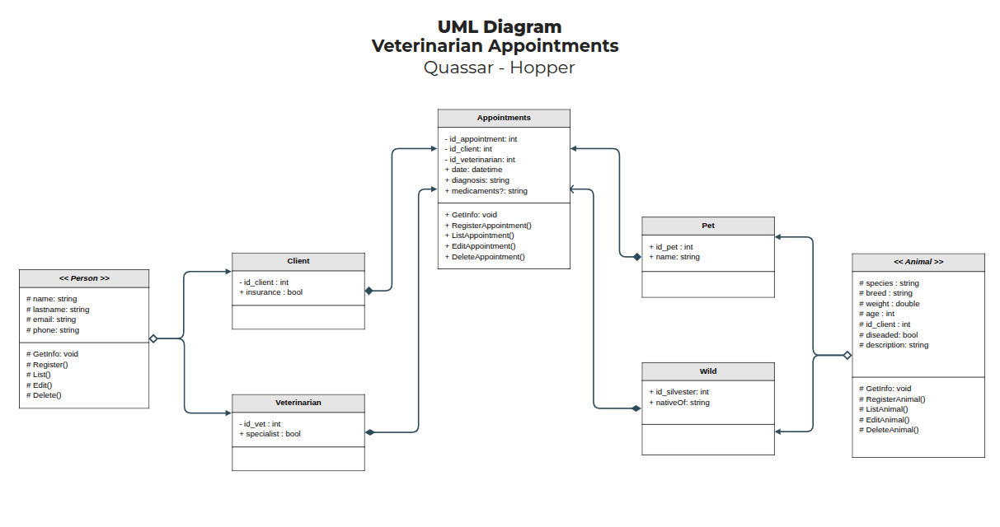
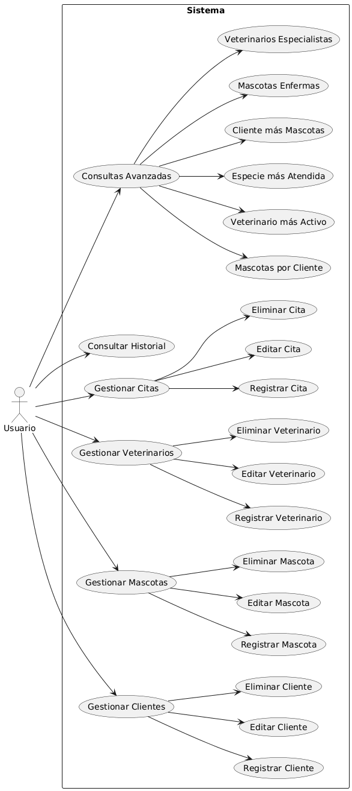

# Sistema Veterinaria San Miguel

## ¿Como empezar?

### Instalar dependencias

```bash
dotnet add package Microsoft.EntityFrameworkCore
dotnet add Microsoft.EntityFrameworkCore.Design
dotnet add Microsoft.Extensions.Configuration
dotnet add Pomelo.EntityFrameworkCore.MySql
dotnet add package Microsoft.Extensions.Configuration
dotnet add package Microsoft.Extensions.Configuration.FileExtensions
dotnet add package Microsoft.Extensions.Configuration.Json
```

### Como hacer una migración

Corre los comandos

**Verifica que dotnet-ef está instalado.**

```bash
dotnet tool install --global dotnet-ef
```

Construye la migración, donde <Nombre Migración> será el nombre.
Imagina que es un commit de git, pero el nombre debe ser unico.

```bash
dotnet ef migrations add <Nombre Migración>
```

Actualiza la base de datos.

```bash
dotnet ef database update 
```

## Entregable

### Ejemplo de sobrecarga de métodos dentro de alguna clase 

[AppointmentService.cs](Services/AppointmentService.cs)

### Diagrama de clases UML


### Diagrama de casos de uso



### Justificación POO

#### 1. Abstracción

```csharp
public abstract class Person  // Abstracción de persona
public abstract class Animal  // Abstracción de animal
```

#### 2. Encapsulamiento

```csharp
public class Client : Person
{
    public bool Insurance { get; set; }           // Propiedades encapsuladas
    private readonly AppDbContext _context;       // Dependencia encapsulada
    
    public void AddClient(Client client)          // Comportamiento encapsulado
    {
        _context.Clients.Add(client);
        _context.SaveChanges();
    }
}
```

#### 3. Herencia

```csharp
public class Client : Person     // Herencia de Person
public class Vet : Person        // Herencia de Person
public class Pet : Animal        // Herencia de Animal  
public class Wild : Animal       // Herencia de Animal
```

#### 4. Polimorfimo

```csharp
// Sobrecarga de métodos
GetVetWithMostAppointments()
GetVetWithMostAppointments(startDate, endDate)
```